# D3

Keeping track of learning D3 here.

Using [Interactive Data Visualization for the Web](https://scottmurray.org/work/d3-book-2e) by Scott Murray to start!
* Note that I am using D3 v7 while the book refers to v4

# How to Run
```
cd src
python -m http.server 8888
```

Then go to `http://localhost:8888`

# Interactive Data Visualization for the Web

## Chapter 2: Introducing D3

p7
* Primary author of D3 is [Mike Bostock](https://bost.ocks.org/mike/)
* Entirely open-source on [GitHub](https://github.com/d3) with other dedicated contributors
* [D3 homepage](https://d3js.org/)

### What it Doesn't Do

p9
* D3 does not hide your original data
  * D3 is run on client-side, so the data to be visualized is sent to the client's computer
  * Can extract data off a graph using [DataThief](https://datathief.org/)
* Don't use D3 if the the data cannot be shared - then what is the point?

### Origins and Context
p10
* [Technical design and philosophy behind D3 (InfoVis paper)](http://vis.stanford.edu/files/2011-D3-InfoVis.pdf)

### Alternatives
p10
* D3 cannot be used on *really* old browsers
* If you need something simple quick and no time to code it up
* Alternatives for: simple charts, connected graphs, geomapping (geographic data)
    * See book for example libraries

p12
* Other tools for drawing free-form vector graphics
    * [paper.js](http://paperjs.org/) - see their examples!
    * [p5.js](https://get-lauren.net/p5-js) (led by Lauren McCarthy)
    * ... and more (see book)

p13
* Rendering 3D: three.js
* Libraries built on top of D3

p14
* More specialized tools that uses or used with D3
    * [Crossfilter](https://github.com/crossfilter/crossfilter) for working with large, multivariate datasets
    * ... a bunch more

## Chapter 3: Technology Fundamentals

* A nice explanation of how the web/browsers work
* Browser developer tools (Chrome: (three dots menu on top-right) -> More Tools -> Developer Tools)
* HTML/CSS/Javascript review

## Chapter 4: Setup

### Downloading D3
Using the updated [D3 docs](https://d3js.org/getting-started#d3-in-vanilla-html) instead.

JavaScript terminology:
* ES Module (ECMA module) - official standard format of Javscript modules (to be able to share/import JavaScript)
* UMD (Universal Module Definition) is another JS module format before a standard existed
  
## Chapter 5: Data

### Generating Page Elements

p72
* [D3 API reference](https://d3js.org/api) to know args/return types

### Binding Data
p78
* `d3.csv()`, `d3.json()`
    * When reading in CSV, all values are stored as a string (ex. integers and floats are stored as a string)
* [Mr. Data Converter](https://shancarter.github.io/mr-data-converter/): convert CSV to JSON/other formats
 
 #### Please Make Your Selection
* `enter()` method:
```js
var dataset = [5, 10, 15, 20, 25];

d3.select("body").selectAll("p")
    .data(dataset)
    .enter()
    .append("p")
    .text("A new paragraph! すげーー");
```

A breakdown of the code above:
* `.selectAll("p")`: Gets a reference to all `"p"` elements in the HTML DOM, even those that *do not exist yet*
* `.data(dataset)`: Counts and parses the data values
  * Method calls after this call will occur `len(dataset)` times
* `.enter()`: This looks at the current DOM and the dataset, and creates new *placeholder elements* in the DOM if there are more data items than DOM elements (from the `.selectAll("p")`), and returns a reference to the *new* DOM elements (not existing ones)

I had to add this to `index.html` for the Developer Tools console to use D3:
```html
<head>
    <meta charset="utf-8">
    <!--Access D3 in the console-->
    <script src="https://cdn.jsdelivr.net/npm/d3@7"></script>
</head>
```

If we then run `d3.selectAll("p")` in the JS console after reloading `index.html`, we can see that each `p` element now has a `__data__` field with a data element from `dataset` binded to the `p` element:
```
> d3.selectAll("p")
Vn {_groups: Array(1), _parents: Array(1)}
    _groups: Array(1)
        0: NodeList(5)
            0: p
                __data__: 5
                ...
```

This data does not exist in the DOM, but exists in memory as `__data__`.

#### Using Your Data
Replace the last line in the code snippet above to add a callback function:
```js
select("body").selectAll("p")
    .data(dataset)
    .enter()
    .append("p")
    .text(function(data) {
        var s = "The number " + data + ", すげーー";
        return s;
    });
```

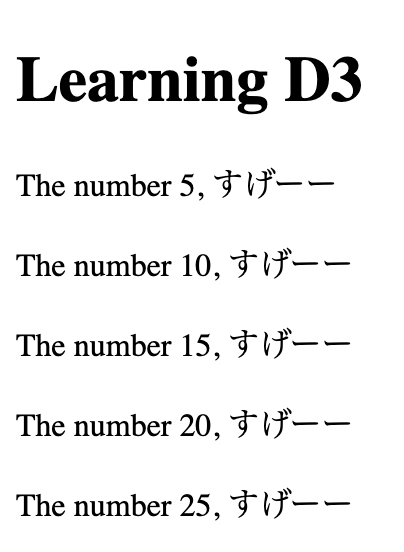

Whenever we call `data()`, we can create an anonymous function that accepts the data element as an argument.

#### Beyond Text
We can modify HTMl/CSS properties with `attr()` and `style()`.

```js
.style("color", function(data) {
    if (data > 15) {
        return "red";
    } else {
        return "black";
    }
});
```

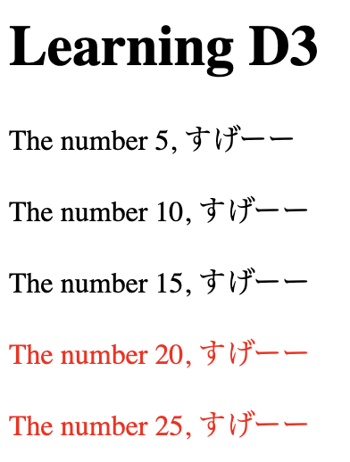

## Chapter 6: Drawing with Data
p91
* Create a style for the class `"bar"` in a separate file `style.css`

```css
div.bar {
    display: inline-block;
    width: 20px;
    height: 75px;
    background-color: teal
}
```
* Move CSS to a separate file and import it in `index.html`:
```html
<link rel="stylesheet" href="style.css">
```
* Then create a `div` with class `"bar'`:
```html
<div class="bar"></div> 
```


* `.classed("bar", true)`: Can apply a style of a class called "bar" to an element (use `false` to remove the style)

#### Back to the Bars
We can apply the `"bar"` style class to our data elements:
```js
var dataset = [5, 10, 15, 20, 25];
d3.select("body").selectAll("p")
    .data(dataset)
    .enter()
    .append("div")
    .attr("class", "bar");
```


Modify the height of the `div` based on the data element:
```js
.attr("class", "bar")
.style("height", function(d) {
    return d + "px";
});
```


Scale the height and add some margin between bars:
```js
.style("height", function(d) {
    var barHeight = d*5; // scale the height for visibility
    return barHeight + "px";
});
```
```css
div.bar {    
    /* ... */
    margin: 2px;
}
```

Yay, a decent-looking bar chart!

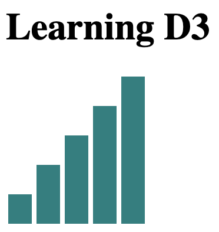

We can inspect the final HTML that is generated:

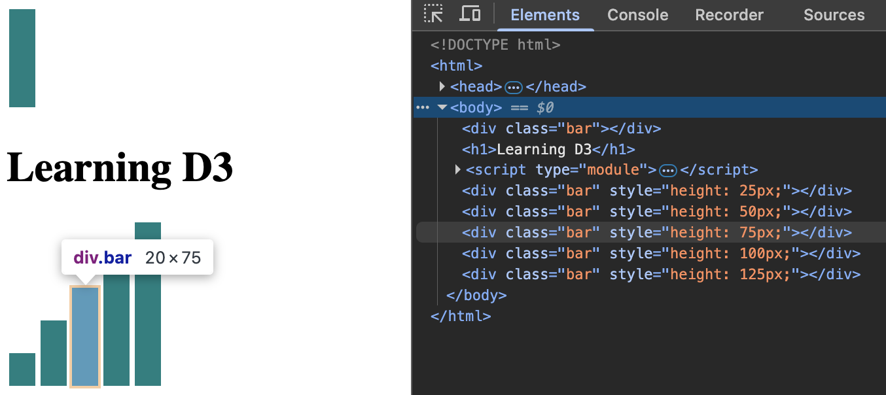

### The Power of `data()`
p93

The `data()` call automatically goes through all the data.

Adding more data items and rules:
```js
var dataset = [
    4, 99, 21, 2, 34, 70, 62, 3, 55, 8
];
d3.select("body").selectAll("p")
    .data(dataset)
    .enter()
    .append("div")
    .attr("class", "bar")
    .style("height", function(d) {
        var barHeight = d*5; // scale the height for visibility
        return barHeight + "px";
    })
    .style("background-color", function(d) {
        if (d > 50) {
            return "#cc5555"; // a nicer red
        } else {
            return "teal";
        }
    });
```

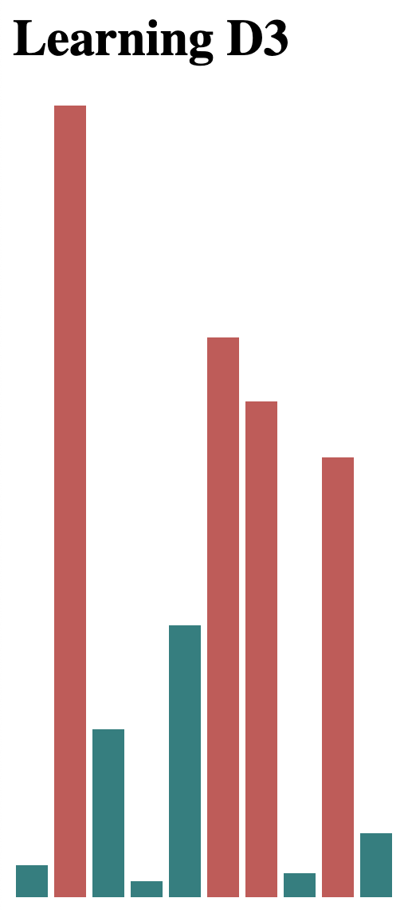

"*The data is driving the visualization - not the other way around.*"

#### Random Data

Generate random data values and graph them:

```js
var dataset = []
for (var i=0; i<25; i++) {
    // Generate a random number between 0 and 100
    var d = Math.random() * 100;
    dataset.push(d);
}
```

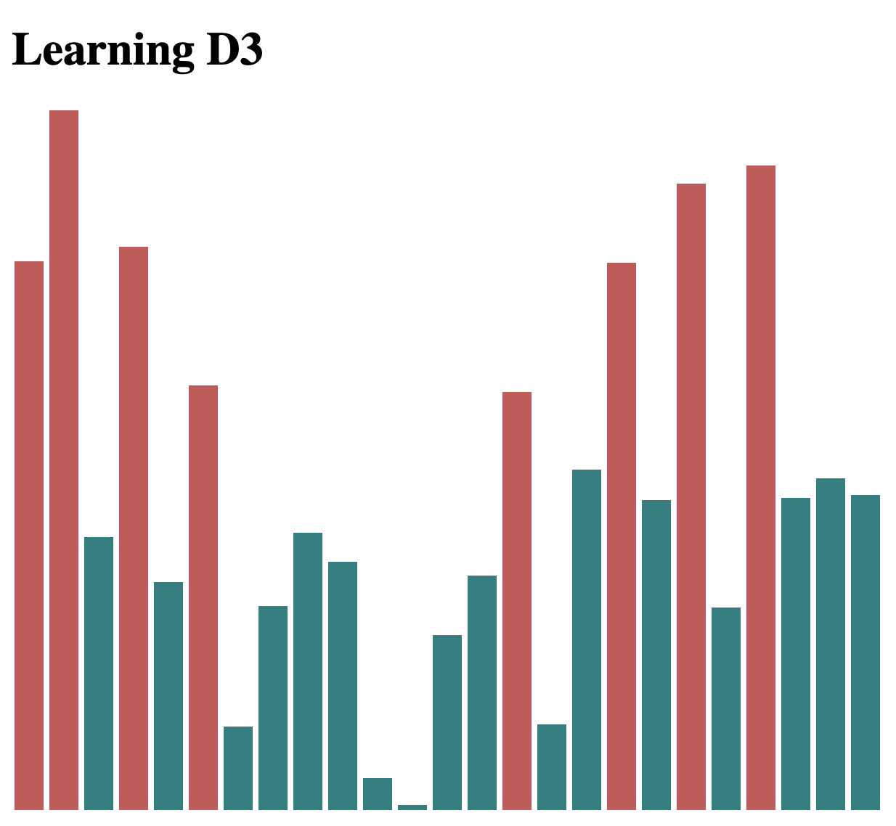
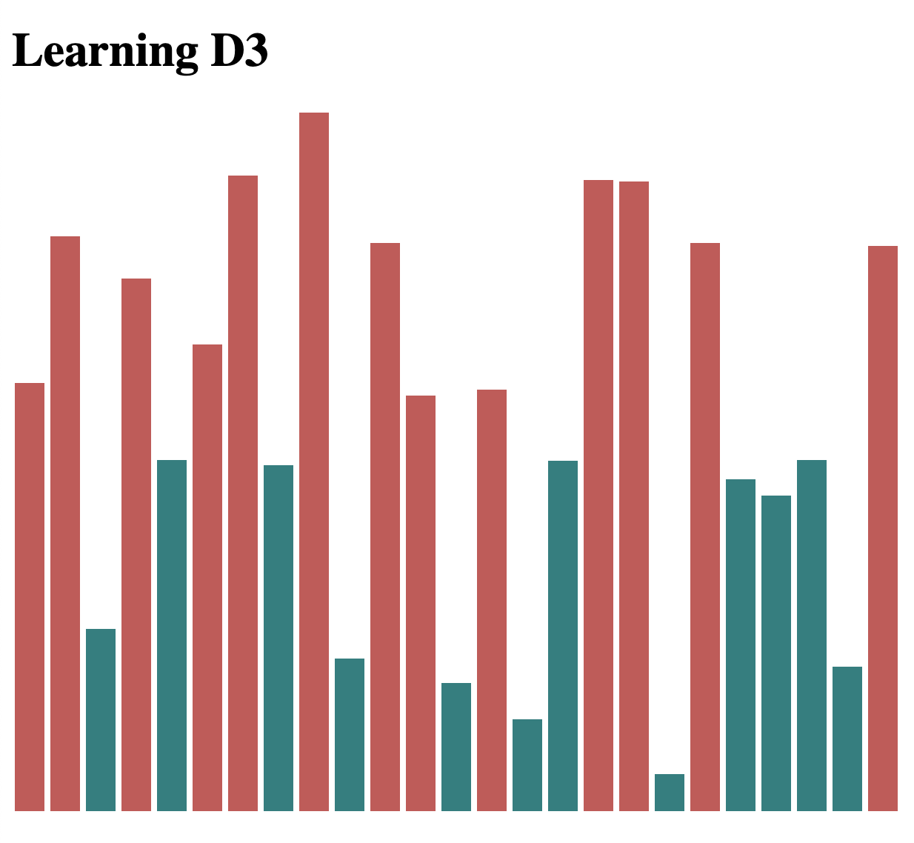
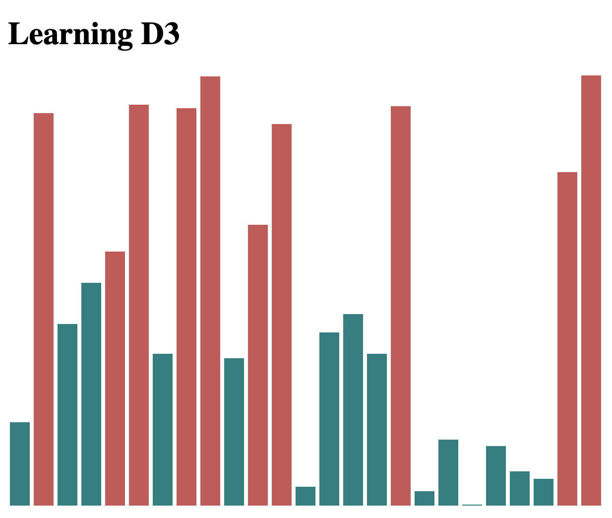
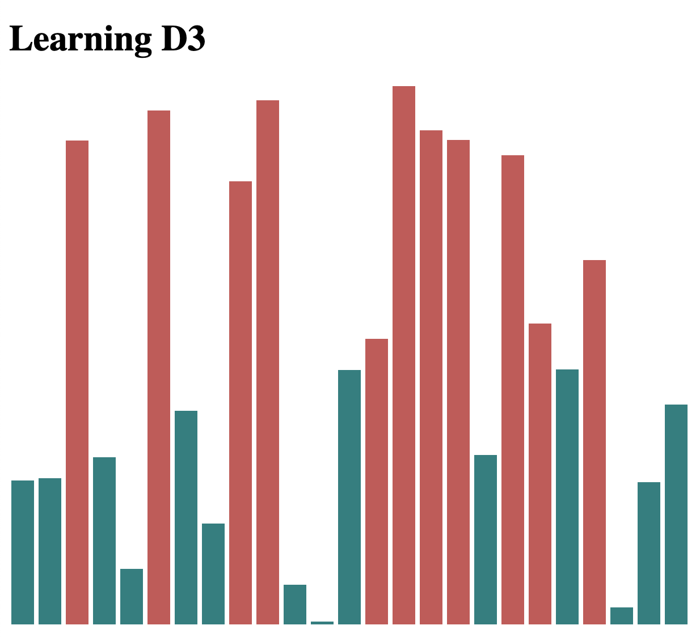

### Drawing SVGs

* SVG format (in the DOM) look like HTML syntax
* D3 `append()` and `attr()` can also be applied to SVGs

#### Create the SVG

Can create an empty SVG element in the DOM:

```js
var svg = d3.select("body").append("svg");
```

With Developer Tools we can see that the element was created:

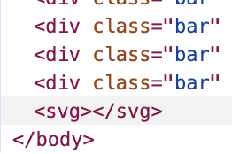

We can reference the SVG element and apply attributes directly:
```js
var width = 500;
var height = 50;
var svg = d3.select("body")
    .append("svg")
    .attr("width", width)
    .attr("height", height);
```

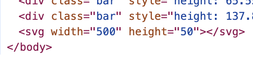


#### Data Driven Shapes

```js
var dataset = [5, 10, 15, 20, 25];

// Create circle elements inside the SVG element
svg.selectAll("circle") // returns a reference to empty Circle elements
    .data(dataset) // Binds each data item in `dataset` to each Circle element
    .enter() // Return a reference to the new element
    .append("circle"); // Add circle to the DOM
```

Add styles based on the data value binded to each circle element
```js
circles.attr("cx", function(d, i) { // d=data element, i=index
        return (i*50) + 25;
    })
```

D3 provides the bounded data `d` and the index `i` within the dataset (`d` and `i` are arbitrary variable names).

[Documentation on all SVG attributes](https://developer.mozilla.org/en-US/docs/Web/SVG/Reference/Attribute). Played around with some:

```js
circles.attr("cx", function(d, i) {
        return (i*50) + 25;
    })
    .attr("cy", height/2)
    .attr("r", function(d) {
        return d;
    })
    .attr("fill", function(d) {
        if (d%10 == 0) {
            return "#db7fef";
        } else {
            return "#91ebf7";
        }
    });
```

Circle attributes [(full docs)](https://developer.mozilla.org/en-US/docs/Web/SVG/Reference/Element/circle)
* `cx`: x-coordinate of the center of the circle in the SVG element
* `cy`: y-coordinate of the center of the circle in the SVG element
* `r`: radius
* `fill`: color of the circle

🫧

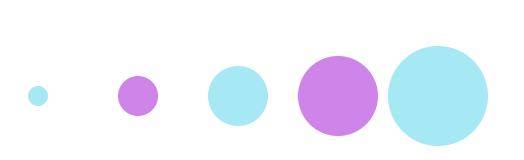

### Making a Bar Chart
