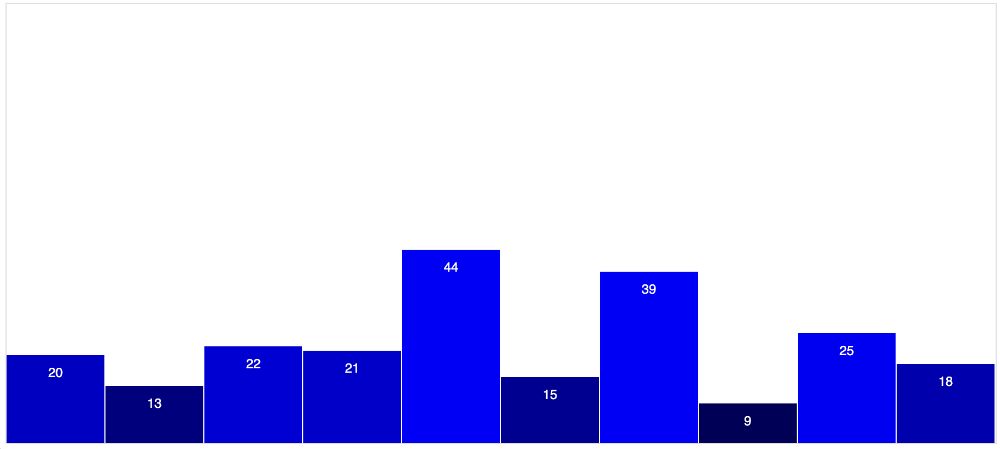
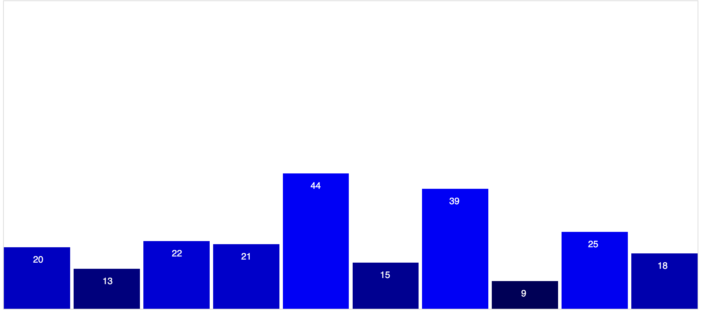
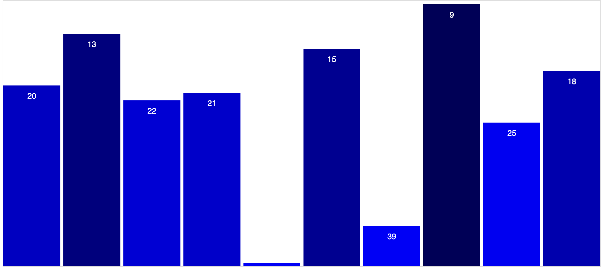
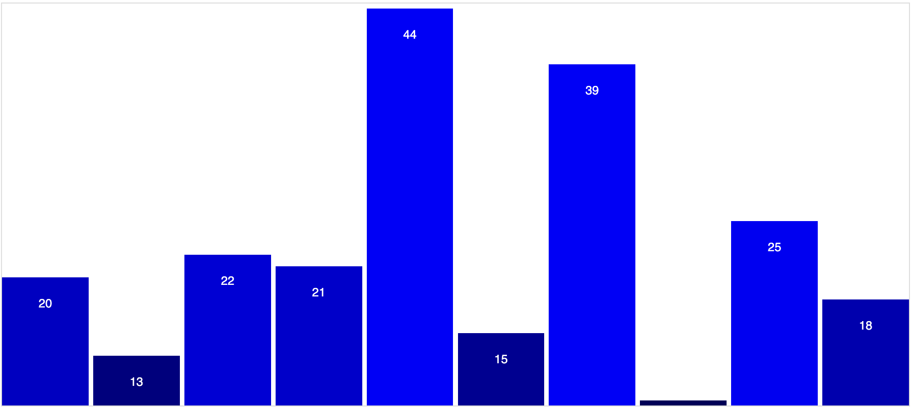
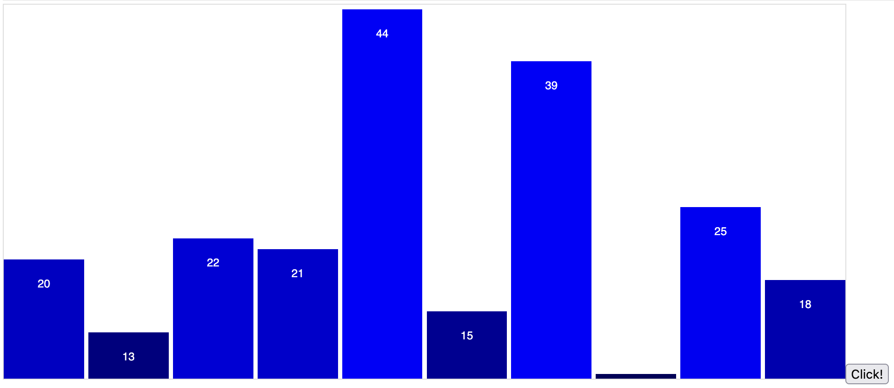
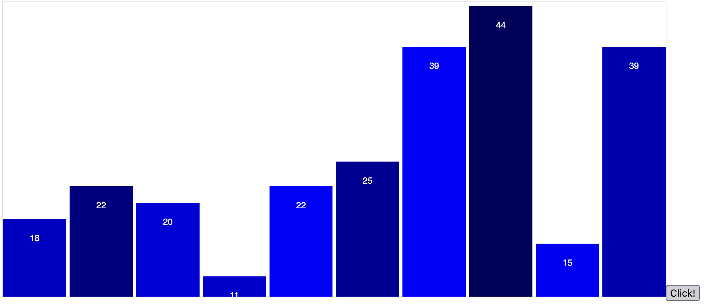
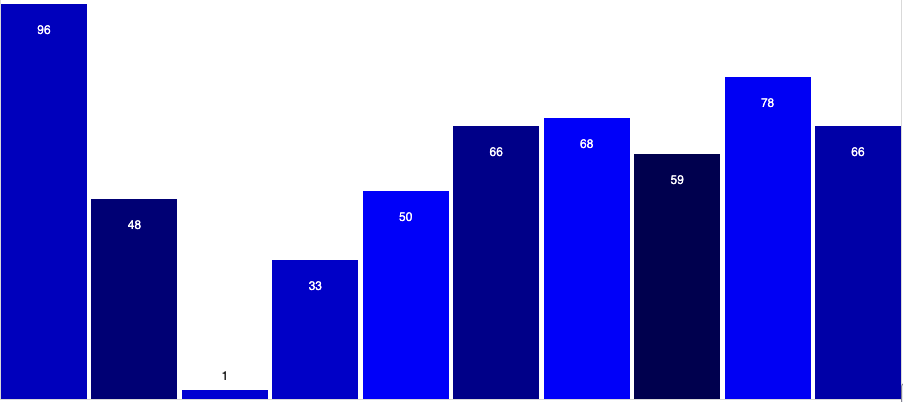
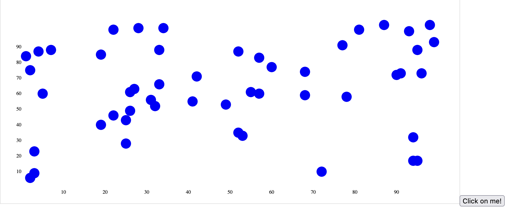
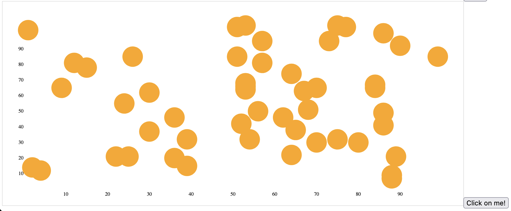
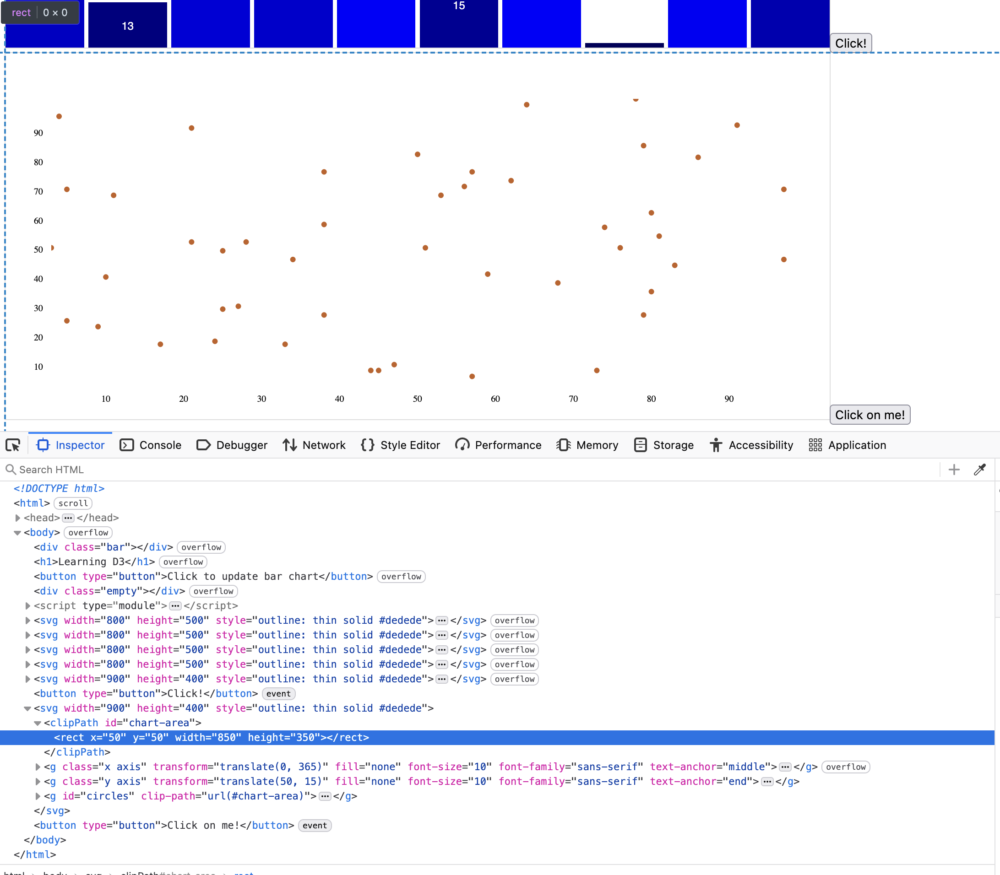

# D3

Keeping track of learning D3 here.

Using [Interactive Data Visualization for the Web](https://scottmurray.org/work/d3-book-2e) (with [code examples here](https://github.com/scotthmurray/d3-book/tree/master)) by Scott Murray to start!
* Note that I am using D3 v7 while the book refers to v4

# How to Run
```
cd src
python -m http.server 8888
```

Then go to `http://localhost:8888`

# Interactive Data Visualization for the Web

## Chapter 2: Introducing D3

p7
* Primary author of D3 is [Mike Bostock](https://bost.ocks.org/mike/)
* Entirely open-source on [GitHub](https://github.com/d3) with other dedicated contributors
* [D3 homepage](https://d3js.org/)

### What it Doesn't Do

p9
* D3 does not hide your original data
  * D3 is run on client-side, so the data to be visualized is sent to the client's computer
  * Can extract data off a graph using [DataThief](https://datathief.org/)
* Don't use D3 if the the data cannot be shared - then what is the point?

### Origins and Context
p10
* [Technical design and philosophy behind D3 (InfoVis paper)](http://vis.stanford.edu/files/2011-D3-InfoVis.pdf)

### Alternatives
p10
* D3 cannot be used on *really* old browsers
* If you need something simple quick and no time to code it up
* Alternatives for: simple charts, connected graphs, geomapping (geographic data)
    * See book for example libraries

p12
* Other tools for drawing free-form vector graphics
    * [paper.js](http://paperjs.org/) - see their examples!
    * [p5.js](https://get-lauren.net/p5-js) (led by Lauren McCarthy)
    * ... and more (see book)

p13
* Rendering 3D: three.js
* Libraries built on top of D3

p14
* More specialized tools that uses or used with D3
    * [Crossfilter](https://github.com/crossfilter/crossfilter) for working with large, multivariate datasets
    * ... a bunch more

## Chapter 3: Technology Fundamentals

* A nice explanation of how the web/browsers work
* Browser developer tools (Chrome: (three dots menu on top-right) -> More Tools -> Developer Tools)
* HTML/CSS/Javascript review

## Chapter 4: Setup

### Downloading D3
Using the updated [D3 docs](https://d3js.org/getting-started#d3-in-vanilla-html) instead.

JavaScript terminology:
* ES Module (ECMA module) - official standard format of Javscript modules (to be able to share/import JavaScript)
* UMD (Universal Module Definition) is another JS module format before a standard existed
  
## Chapter 5: Data

### Generating Page Elements

p72
* [D3 API reference](https://d3js.org/api) to know args/return types

### Binding Data
p78
* `d3.csv()`, `d3.json()`
    * When reading in CSV, all values are stored as a string (ex. integers and floats are stored as a string)
* [Mr. Data Converter](https://shancarter.github.io/mr-data-converter/): convert CSV to JSON/other formats
 
 #### Please Make Your Selection
* `enter()` method:
```js
var dataset = [5, 10, 15, 20, 25];

d3.select("body").selectAll("p")
    .data(dataset)
    .enter()
    .append("p")
    .text("A new paragraph! すげーー");
```

A breakdown of the code above:
* `.selectAll("p")`: Gets a reference to all `"p"` elements in the HTML DOM, even those that *do not exist yet*
* `.data(dataset)`: Counts and parses the data values
  * Method calls after this call will occur `len(dataset)` times
* `.enter()`: This looks at the current DOM and the dataset, and creates new *placeholder elements* in the DOM if there are more data items than DOM elements (from the `.selectAll("p")`), and returns a reference to the *new* DOM elements (not existing ones)

I had to add this to `index.html` for the Developer Tools console to use D3:
```html
<head>
    <meta charset="utf-8">
    <!--Access D3 in the console-->
    <script src="https://cdn.jsdelivr.net/npm/d3@7"></script>
</head>
```

If we then run `d3.selectAll("p")` in the JS console after reloading `index.html`, we can see that each `p` element now has a `__data__` field with a data element from `dataset` binded to the `p` element:
```
> d3.selectAll("p")
Vn {_groups: Array(1), _parents: Array(1)}
    _groups: Array(1)
        0: NodeList(5)
            0: p
                __data__: 5
                ...
```

This data does not exist in the DOM, but exists in memory as `__data__`.

#### Using Your Data
Replace the last line in the code snippet above to add a callback function:
```js
select("body").selectAll("p")
    .data(dataset)
    .enter()
    .append("p")
    .text(function(data) {
        var s = "The number " + data + ", すげーー";
        return s;
    });
```


Whenever we call `data()`, we can create an anonymous function that accepts the data element as an argument.

#### Beyond Text
We can modify HTMl/CSS properties with `attr()` and `style()`.

```js
.style("color", function(data) {
    if (data > 15) {
        return "red";
    } else {
        return "black";
    }
});
```


## Chapter 6: Drawing with Data
p91
* Create a style for the class `"bar"` in a separate file `style.css`

```css
div.bar {
    display: inline-block;
    width: 20px;
    height: 75px;
    background-color: teal
}
```
* Move CSS to a separate file and import it in `index.html`:
```html
<link rel="stylesheet" href="style.css">
```
* Then create a `div` with class `"bar'`:
```html
<div class="bar"></div> 
```


* `.classed("bar", true)`: Can apply a style of a class called "bar" to an element (use `false` to remove the style)

#### Back to the Bars
We can apply the `"bar"` style class to our data elements:
```js
var dataset = [5, 10, 15, 20, 25];
d3.select("body").selectAll("p")
    .data(dataset)
    .enter()
    .append("div")
    .attr("class", "bar");
```


Modify the height of the `div` based on the data element:
```js
.attr("class", "bar")
.style("height", function(d) {
    return d + "px";
});
```


Scale the height and add some margin between bars:
```js
.style("height", function(d) {
    var barHeight = d*5; // scale the height for visibility
    return barHeight + "px";
});
```
```css
div.bar {    
    /* ... */
    margin: 2px;
}
```

Yay, a decent-looking bar chart!


We can inspect the final HTML that is generated:


### The Power of `data()`
p93

The `data()` call automatically goes through all the data.

Adding more data items and rules:
```js
var dataset = [
    4, 99, 21, 2, 34, 70, 62, 3, 55, 8
];
d3.select("body").selectAll("p")
    .data(dataset)
    .enter()
    .append("div")
    .attr("class", "bar")
    .style("height", function(d) {
        var barHeight = d*5; // scale the height for visibility
        return barHeight + "px";
    })
    .style("background-color", function(d) {
        if (d > 50) {
            return "#cc5555"; // a nicer red
        } else {
            return "teal";
        }
    });
```


"*The data is driving the visualization - not the other way around.*"

#### Random Data

Generate random data values and graph them:

```js
var dataset = []
for (var i=0; i<25; i++) {
    // Generate a random number between 0 and 100
    var d = Math.random() * 100;
    dataset.push(d);
}
```


### Drawing SVGs

* SVG format (in the DOM) look like HTML syntax
* D3 `append()` and `attr()` can also be applied to SVGs

#### Create the SVG

Can create an empty SVG element in the DOM:

```js
var svg = d3.select("body").append("svg");
```

With Developer Tools we can see that the element was created:


We can reference the SVG element and apply attributes directly:
```js
var width = 500;
var height = 50;
var svg = d3.select("body")
    .append("svg")
    .attr("width", width)
    .attr("height", height);
```


#### Data Driven Shapes

```js
var dataset = [5, 10, 15, 20, 25];

// Create circle elements inside the SVG element
svg.selectAll("circle") // returns a reference to empty Circle elements
    .data(dataset) // Binds each data item in `dataset` to each Circle element
    .enter() // Return a reference to the new element
    .append("circle"); // Add circle to the DOM
```

Add styles based on the data value binded to each circle element
```js
circles.attr("cx", function(d, i) { // d=data element, i=index
        return (i*50) + 25;
    })
```

D3 provides the bounded data `d` and the index `i` within the dataset (`d` and `i` are arbitrary variable names).

[Documentation on all SVG attributes](https://developer.mozilla.org/en-US/docs/Web/SVG/Reference/Attribute). Played around with some:

```js
circles.attr("cx", function(d, i) {
        return (i*50) + 25;
    })
    .attr("cy", height/2)
    .attr("r", function(d) {
        return d;
    })
    .attr("fill", function(d) {
        if (d%10 == 0) {
            return "#db7fef";
        } else {
            return "#91ebf7";
        }
    });
```

Circle attributes [(full docs)](https://developer.mozilla.org/en-US/docs/Web/SVG/Reference/Element/circle)
* `cx`: x-coordinate of the center of the circle in the SVG element
* `cy`: y-coordinate of the center of the circle in the SVG element
* `r`: radius
* `fill`: color of the circle

🫧


### Making a Bar Chart

Create rectangles inside of an SVG object in the DOM:

```js
// Create an SVG element inside the DOM body element
var width = 500;
var height = 100;
var svg = d3.select("body")
    .append("svg")
    .attr("width", width)
    .attr("height", height)
    .attr("style", "outline: thin solid #dedede");

// Select all the *future* rectangles that will be created
svg.selectAll("rect")
    .data(dataset)  // dataset is passed onto enter()
    .enter()        // which creates an empty reference to each data value
    .append("rect") // Creates a rectangle for each data value
    .attr("x", function(data, index) {
        return index * (width / dataset.length);
    })   // Apply the following attributes to each rectangle
    .attr("y", 0)
    .attr("width", 20)
    .attr("height", 100);
```


If we adjust the bar height with the data value:
```js
.attr("height", function(data, index) {
    return data;
});
```

the bars are upside down:


This is because the SVG coordinate system has `(x=0, y=0)` at the top-left corner of the SVG object:


We want the base of the rectangle to be at the bottom of the SVG object minus the height of the bar (which is just `data`), so that it fits in the SVG object:
```js
.attr("y", function(data, index) {
    return svgHeight - data;
})
```


#### Color

Adjust the color based on bar height:
```js
.attr("fill", function(data, index) {
    return "rgb(" + Math.round(data*10) + ", 0, 0)";
});
```


#### Labels

We create a `text` element in the SVG object for each dataset, and apply attributes:

```js
// Selects all *future* text that will be created
svg.selectAll("text")
    .data(dataset) // the dataset to be passed into enter()
    .enter()
    .append("text") // Creates an empty reference to a text object for this data value
    .text(function(data, index) { // Not set via attr()
        return data;
    })
    .attr("x", function(data, index) {
        // Set the label to be positioned in the middle of the bar
        let barWidth = (svgWidth / dataset.length) - barPadding;
        return index * (svgWidth / dataset.length) + (barWidth / 2); // padding
    })
    .attr("y", function(data, index) {
        return svgHeight - (data*4) + 20; // +20 padding
    })
    .attr("fill", "white")
    .attr("font-size", "12px")
    .attr("font-family", "sans-serif")
    .attr("text-anchor", "middle"); // set label to be in the middle
```


### Making a Scatterplot

We now use 2-dimensional data:

```js
// Scatterplot dataset
var dataset = [
    [134, 223],
    [208, 117],
    [121, 55],
    [311, 211],
    [145, 131],
    [212, 17]
];
// Create the SVG element in the DOM
var svg = d3.select("body")
    .append("svg")
    .attr("width", svgWidth)
    .attr("height", svgHeight)
    .attr("style", "outline: thin solid #dedede");

// For each datapoint, we create a circle
svg.selectAll("circle") // Get a reference to all *future* circles that will be created
    .data(dataset)      // Get the dataset to be applied to each circle
    .enter()            // Pass in `dataset` to enter()
    .append("circle")   // Create the actual circle
    .attr("cx", function(data, index) {
        return data[0];
    })
    .attr("cy", function(data, index) {
        return data[1];
    })
    .attr("fill", "black")
    .attr("r", 3);
```

Just some dots... 😆


If we want to use the circle's size to represent the data that the circle is bounded to, use the circle's *area*, not radius.
This is because human perception associates a circle's area to its "value" - using the circle's radius would lose that relativity between circles and overexaggerate the difference between data points (as circles).

Area `A` of a circle:
```
A = πr^2
```

What do we need to set the radius `r` to in our visualization?

```
A/π = r^2
sqrt(A/π) = r
```

We use the data value of the circle to "correlate" with the area `A` in the equation.

Here we arbitrarily make circles larger if the data have a greater `y` value:
```js
.attr("r", function(data, index) {
    return Math.sqrt(data[1] / Math.PI);
});
```


#### Labels

```js
// Labels for each point in the scatterplot
svg.selectAll("text")
    .data(dataset)
    .enter()
    .append("text")
    .text(function(data, index) {
        return "(" + data[0] + ", " + data[1] + ")";
    })
    .attr("x", function(data, index) {
        return data[0];
    })
    .attr("y", function(data, index) {
        return data[1] + 21; // padding
    })
    .attr("text-anchor", "middle");
```


## Chapter 7: Scales

*"Scales are functions that map from an input domain to an output range."*

* Scales are a mathematical relationship between data
* **Axes** are a visual representation of scales
* Many types of scales: linear, ordinal, logarithmic, square root, etc...
* Use scales instead of hard-coded pixel values when displaying points

### Domain and Ranges

Given a hypothetical dataset `[1, 2, 3, 4, 5]`:
* **Input domain**: are the range of possible data values (in the example dataset, this would be 1-5)
* **Output range**: is the posslble *display values* that the data gets mapped to onto the screen
  * This is determined by the visalization designer
  * Example: the smallest value `1` gets mapped to pixel value `10px` and the largest value `5` gets mapped to pixel value `100px`.

### Normalization

With a linear scale, the above is performing *normalization*, mapping a numeric value to a value between 0 and 1.

### Creating a Scale

We can access D3's scale function with (on the console, for example):
```js
> var scale = d3.scaleLinear(); // in Javascript, functions can also be variables
> scale(2.5);
2.5
```

We need to set the domain and range of the scale:
```js
> scale.domain([100, 500]);
> scale.range([10, 350]);
```

Now input values are appropriately scaled:
```js
> scale(100)
10
> scale(200)
95
> scale(500)
350
```

We can use D3's scale function in our `attr()` when plotting points.

### Scaling the Scatterplot

We can also use `d3.min()` and `d3.max()`

```js
// Create scalesi that will ensure that the points always fit in the SVG object
// We fit the dataset values to the width and height of the SVG
var xScale = d3.scaleLinear()
    // Across the dataset, compare each value's first element with each other
    .domain([0, d3.max(dataset, function(data) { return data[0]; })])
    // Map the dataset x-values to the bounds of the SVG's width
    .range([0, svgWidth]);
var yScale = d3.scaleLinear()
    .domain([0, d3.max(dataset, function(data) { return data[1]})])
    .range([0, svgHeight]);
```

and apply the scales to the x and y values of the circles and the labels:
```js
.attr("cx", function(data, index) {
    return xScale(data[0]);
})
.attr("cy", function(data, index) {
    return yScale(data[1]);
})
```

```js
.attr("x", function(data, index) {
    return xScale(data[0]);
})
.attr("y", function(data, index) {
    return yScale(data[1]) + 20; // padding 
})
```


We can change `yScale` to flip y-values so that larger y-values are at the top:
```js
.range([svgHeight, 0]);
```


Add some padding in the scales so that the points completely fit in the SVG:
```js
var padding = 20;
var xScale = d3.scaleLinear()
    // Across the dataset, compare each value's first element with each other
    .domain([0, d3.max(dataset, function(data) { return data[0]; })])
    // Map the dataset x-values to the bounds of the SVG's width
    .range([padding, svgWidth - padding]);
var yScale = d3.scaleLinear()
    .domain([0, d3.max(dataset, function(data) { return data[1]})])
    .range([svgHeight - padding, padding]);
```


If we change the size of the SVG or add a new data point `[800, 400]` in the far corner, the image adjusts/scales automatically:


### Other Methods

There's a bunch of other D3 scales, such as `scaleSqrt`, `scalePow`. See [the docs](https://d3js.org/d3-scale) for a full list.

We can use `scaleSqrt` to adjust the circle's area more easily:

```js
var aScale = d3.scaleSqrt()
    .domain([0, d3.max(dataset, function(data) { return data[1]; })])
    .range([0, 10]); // Range is arbitrary - what matters is that the circle areas are relative
```

```js
.attr("r", function(data, index) {
    return aScale(data[1]);
});
```


### Time Scales

[Javascript `Date` object](https://developer.mozilla.org/en-US/docs/Web/JavaScript/Reference/Global_Objects/Date) represents a moment in time in Javascript.

On the console:
```js
> new Date
Date Fri Dec 19 2025 09:23:13 GMT-0500 (Eastern Standard Time)
```

Cool tangents to read about on the concept of time:
* [UTC: The World's Time Standard](https://www.timeanddate.com/time/aboututc.html)
* [moment.js](https://momentjs.com/)
* [Data Stores podcast - Rocket Science with Rachel Binx](https://datastori.es/70-rocket-science-with-rachel-binx/)

Javascript and D3 can only work with time with `Date` objects.

#### Converting strings to dates

D3 provides functions to parse strings of varying formats into `Date` objects, see the documentation on [d3-time-formats](https://d3js.org/d3-time-format).
* [timeParse](https://d3js.org/d3-time-format#timeParse)
* [timeFormatLocale](https://d3js.org/d3-time-format#timeFormatLocale)

```js
> var parseTime = d3.timeParse("%m/%d/%y")
> parseTime("12/19/25")
Date Fri Dec 19 2025 00:00:00 GMT-0500 (Eastern Standard Time)
```

We can read in a CSV file of dates `time_scale_data.csv`:
```csv
Date,Amount
12/19/25,10
12/20/25,20
12/21/25,31
12/22/25,32
12/23/25,33
12/24/25,40
12/25/25,55
```

and parse the contents to Javascript objects with converted `Date` objects and integers (recall CSV values are strings, even integers):
```js
var timeParser = d3.timeParse("%m/%d/%y");
var csvRowConverter = function(row) {
    return {
        date: timeParser(row.Date),
        amount: parseInt(row.Amount)
    };
};
// Need to reference data in the `then()` callback, as d3.csv() is async
d3.csv("data/time_scale_data.csv", csvRowConverter)
    .then(function(parsedData) {
        console.log(parsedData);
    });
```

The `then()` call is related to async/await in Javascript. `then()` is the logic to run after the `d3.csv()` finished.

```js
var dataset = await d3.csv("data/time_scale_data.csv", csvRowConverter)
    .then(function(parsedData) {
        console.log(parsedData);
        return parsedData;
    });
```


#### Scaling time

We use `d3.timeScale` to create a scale that maps `Date` objects to pixel values in our SVG scatterplot:
```js
var xScale = d3.scaleTime()
    .domain([
        d3.min(dataset, function(data) { return data.date; }),
        d3.max(dataset, function(data) { return data.date; })
    ])
    .range([
        padding, svgWidth - padding
    ]);
```

Use the amount value to scale the circle's size:
```js
var areaScale = d3.scaleSqrt()
    .domain([0, d3.max(dataset, function(data) { return data.amount; })])
    .range([0, 10]); // Range is arbitrary - what matters is that the circle areas are relative
```

Create labels for each circle/data point (see [locale format](https://d3js.org/d3-time-format#locale_format) for formatting options):
```js
// Display date/amount value for each circle
var formatTime = d3.timeFormat("%b %e");
svg.selectAll("text")
    .data(dataset)
    .enter()
    .append("text")
    .text(function(data, index) { return formatTime(data.date); })
    .attr("x", function(data, index) { return xScale(data.date); })
    .attr("y", function(data, index) {
        return yScale(data.amount) + 25; // padding
    })
    .attr("text-anchor", "middle")
    .attr("font-size", "14")
    .attr("fill", "#736272")
    .attr("font-family", "sans-serif");
```


## Chapter 8: Axes

[D3 axes](https://d3js.org/d3-axis) are *functions* that generate the visual elements of an axis, like ticks, values, labels.
* D3 axes generates visuals, D3 scales return values.
* Axes are tied to SVGs, and only work with numerical values (as opposed to categorical).


### Setting up an axis

Four axis constructors:
* `d3.axisTop`
* `d3.axisBottom`
* `d3.axisRight`
* `d3.axisLeft`

In our scatter plot, we can create an axis:

```js
var xAxis = d3.axisBottom(xScale);
svg.append("g") // SVG group
    .attr("class", "axis") // Name the SVG group to axis"
    .call(xAxis); // Passes the `g` SVG element to xAxis()
```

The [`g` SVG element](https://developer.mozilla.org/en-US/docs/Web/SVG/Reference/Element/g) means group.


### Positioning Axis

We can apply an [SVG transform](https://developer.mozilla.org/en-US/docs/Web/SVG/Reference/Attribute/transform) to `axisBottom()` to bring the axis to the bottom. Possible transforms: `translate`, `scale`, `rotate`, `skew`.

```js
svg.append("g") // SVG group
    .attr("class", "axis")  // Name the SVG group to axis"
    .attr("transform", "translate(0, " + (svgHeight - padding) + ")")
    .call(xAxis); // Passes the `g` SVG element to xAxis()
```


CSS styles can be applied to the axis using the `.axis` selector and modifying `path`, `line`, and `text`:

[SVG `shape-rendering` property](https://developer.mozilla.org/en-US/docs/Web/SVG/Reference/Attribute/shape-rendering) for crisper edges, optimize for speed, etc.

Note that CSS property names can differ from SVG attribute names (ex. CSS `color` vs. SVG`fill`). See [SVG attributes](https://developer.mozilla.org/en-US/docs/Web/SVG/Reference/Attribute).


### Check for Ticks
(笑)

We can adjust the number of ticks on the axis (see [docs](https://d3js.org/d3-array/ticks)).

```js

var xAxis = d3.axisBottom(xScale).ticks(5);
```


We specified 5 ticks but D3 tries to add the optimal amount of ticks for the axis to be easily readable.

Manual tick values can also be used with `axisBottom().tickValues([])` (but does not work for time scales...).

### Y Not?

```js
var yAxis = d3.axisLeft(yScale);
svg.append("g")
    .attr("class", "axis")
    .attr("transform", "translate(" + padding  + ", 0)")
    .call(yAxis);
```


### Final Touches

Create a random dataset on webpage refresh and generate a scatter plot:

```js
// Make a random dataset and plot a scatterplot
var dataset = [];
var xMax = 100;
var yMax = 100;
var numPoints = 50;
for (var i=0; i<numPoints; i++) {
    var x = Math.floor(Math.random() * xMax);
    var y = Math.floor(Math.random() * yMax);
    dataset.push([x, y]);
}

// Create scales for x and y values
var svgPadding = 50;
var xScale = d3.scaleLinear()
    .domain([
        d3.min(dataset, function(p) { return p[0]; }),
        d3.max(dataset, function(p) { return p[0]; })
    ]) //
    .range([svgPadding, svgWidth - svgPadding]); // which pixel in the SVG to map to

var yScale = d3.scaleLinear()
    .domain([
        d3.min(dataset, function(p) { return p[0]; }),
        d3.max(dataset, function(p) { return p[0]; })
    ])
    .range([svgHeight - svgPadding, svgPadding]);

var svg = d3.select("body")
    .append("svg")
    .attr("width", svgWidth)
    .attr("height", svgHeight)
    .attr("style", "outline: thin solid #dedede");

svg.selectAll("circle")
    .data(dataset)
    .enter()
    .append("circle")
    .attr("cx", function(data, index) {
        return xScale(data[0]);
    })
    .attr("cy", function(data, index) {
        return yScale(data[1]);
    })
    .attr("r", 3)
    .attr("fill", "#c46021"); 

var xAxis = d3.axisBottom(xScale);
svg.append("g") // SVG group
    .attr("class", "axis")  // Name the SVG group to axis"
    .attr("transform", "translate(0, " + (svgHeight - svgPadding + 15) + ")")
    .call(xAxis); // Passes the `g` SVG element to xAxis()

var yAxis = d3.axisLeft(yScale);
svg.append("g")
    .attr("class", "axis")
    .attr("transform", "translate(" + (svgPadding) + ", 15)")
    .call(yAxis);
```


### Formatting Tick Labels

We can use [`axis.tickFormat`](https://d3js.org/d3-axis#axis_tickFormat) if we want cleaner labels on our axes when using decimals/percentages.

We define the formatting we want with `d3.format()`, for example:
```js
var formatAsPercentage = d3.format(".1%");
```

This returns a function, which can format any floating point to a percentage string.
```js
> var formatAsPercentage = d3.format(".1%");
> formatAsPercentage(0.1);
"10.0%" 
```

We pass this function to the axis `tickFormat()`:
```js
xAxis.tickFormat(formatAsPercentage);
```

### Time-Based Axes

Add some padding to the xScale/yScale, which adds a bit of padding on the axes:
```js
// Create new Date objects, otherwise a reference to the dataset is given
// (which then we modify the min/max Date values)
var minDate = new Date(d3.min(dataset, function(data) { return data.date; }));
minDate.setDate(minDate.getDate() - 1);
var maxDate = new Date(d3.max(dataset, function(data) { return data.date; }));
maxDate.setDate(maxDate.getDate() + 1) 
var xScale = d3.scaleTime()
    .domain([minDate, maxDate])
    .range([
        padding, svgWidth - padding
    ]);
// y-values of amounts
var yScale = d3.scaleLinear()
    .domain([
        d3.min(dataset, function(data) { return data.amount; }) - 10,   // padding
        d3.max(dataset, function(data) { return data.amount; }) + 10    // padding
    ])
    .range([
        svgHeight - padding, padding
    ]);
```

Format the x-axis:
```js
var timeFormat = d3.timeFormat("%b %d");
var xAxis = d3.axisBottom(xScale)
    .tickFormat(timeFormat)
    .ticks(5);
```


## Chapter 9: Updates, Transitions, and Motion

So far we only used *static datasets*. How to visualize data that changes over time?
In D3, dataset changes are handled by *updates*, visual adjustments are handled by *transitions*, where *motion* can be added.

### Ordinal Scales, Explained
[*Ordinal data*](https://d3js.org/d3-scale/ordinal) describe data that can be grouped into categories, with some inherent order to the categories. The domain and range are discrete values. Examples:
* Exam grades: grade D, grade C, grade B, grade A
* Freshmen, sophomore, junior, senior
* Strongly dislike, dislike, neutral, like, strongly like

[`d3.scaleBand()`](https://d3js.org/d3-scale/band) is like an ordinal scale, but while the domain is discrete (categories/buckets), the range is continuous. This scale is useful for bar charts.

Let's revisit the bar chart (re-colored in blue):

```js
var dataset = [
    20, 13, 22, 21, 44, 15, 39, 9, 25, 18
];

```


Let's focus on the x-position of the bars. We can think of each index in the `dataset` array as a category, or the domain of this scale, each category/bar mapping to a pixel value in the SVG:

```js
// Create an ordinal scale to handle positioning of bars
// and their labels
var xScale = d3.scaleBand()
    .domain(d3.range(dataset.length)) // creates an array [0, 1, 2, ..., dataset.length-1]
    .rangeRound([0, svgWidth])
    .paddingInner(0.05);
```

### Starting Your Own Band
This line: 
```js
.rangeRound([0, svgWidth])
```

essentially maps each domain value `[0, 1, 2, ..., dataset.length-1]` to a band of equal length (`svgWidth/dataset.length`).

`rangeRound()` will round the band value to a whole number (as opposed to `range()`). This is useful if we do not want to map to fractional pixel values, which would lead to visually fuzzy bars.

### Referencing the band scale

We can compute the x-position of the bars with `xScale(i)` (`i` being the index of the data value in `dataset`) and the width of the bar with `xScale.bandwidth()` (the padding is already calculated by `xScale`):
```js
svg.selectAll("rect")
    .data(dataset)  // dataset is passed onto enter()
    .enter()        // which creates an empty reference to each data value
    .append("rect") // Creates a rectangle for each data value
    .attr("x", function(data, index) {
        return xScale(index)
    })
    .attr("width", xScale.bandwidth())
```



Scaling the y values:
```js
svg.selectAll("rect")
    .data(dataset)  // dataset is passed onto enter()
    .enter()        // which creates an empty reference to each data value
    .append("rect") // Creates a rectangle for each data value
    .attr("x", function(data, index) {
        return xScale(index);
    })   // Apply the following attributes to each rectangle
    .attr("y", function(data, index) {
        return svgHeight - yScale(data);
    })
    .attr("width", xScale.bandwidth())
    .attr("height", function(data, index) {
        return yScale(data);
    })
```

Use the scales the set the labels:
```js
// Selects all *future* text that will be created
svg.selectAll("text")
    .data(dataset) // the dataset to be passed into enter()
    .enter()
    .append("text") // Creates an empty reference to a text object for this data value
    .text(function(data, index) { // Not set via attr()
        return data;
    })
    .attr("x", function(data, index) {
        return xScale(index) + xScale.bandwidth()/2;
    })
    .attr("y", function(data, index) {
        return svgHeight - yScale(data) + labelPadding;
    })
    .attr("fill", "white")
    .attr("font-size", "12px")
    .attr("font-family", "sans-serif")
    .attr("text-anchor", "middle"); // set label to be in the middle
```

There is a bug... (bars are height-reversed), will fix...



Oops, `yScale` should compute the height of the bar:
```js
var yScale = d3.scaleLinear()
    .domain([
        d3.min(dataset),
        d3.max(dataset)
    ])
    .range([
        svgPadding, svgHeight - svgPadding  // <--- fixed here
    ]);
```



### Updating Data

#### Interaction via Event Listeners

We can create a button in HTML:
```html
<button type="button">Click to update bar chart</button>
```

and apply an event listener to it:
```js
d3.select("button").on("click", function() {
    console.log("The button was clicked!");
})
```


When clicked, we see the log in the JS console:

```
The button was clicked!
```

#### Changing the Data
We can also dynamically create a button and attach an event handler to it:
```js
// Create an event handler for re-loading new data into the bar chart
var button = d3.select("body").append("button").text("Click!").attr("type", "button");
button.on("click", function() {
    console.log("The button was clicked!");
    var dataset = [
        40, 18, 17, 10, 57, 19, 27, 28, 36, 11
    ];
    svg.selectAll("rect")
        .data(dataset) // Bind the new dataset
        .attr("y", function(d, i) {
            return svgHeight - yScale(d);
        })
        .attr("height", function(d, i) {
            return yScale(d);
        });
})
```





### Transitions
We can add animated transitions by calling `transition()` after the selection is made and data is binded, but before other visual changes are made:
```js
svg.selectAll("rect")
    .data(dataset)
    .transition() // <--- Added here!
    .attr("y", function(d, i) {
        return svgHeight - yScale(d);
    })
    .attr("height", function(d, i) {
        return yScale(d);
    });
```

D3 will interpolate the current state and the next desired state and apply those changes over time.

#### `duration()` or How Long Is This Going to Take?
We can add `duration()` after the `transition()` call to configure how long the whole transition animation lasts. The `duration()` call takes in a value in miliseconds, and the default is 250ms.

```js
svg.selectAll("rect")
    .data(dataset)
    .transition()
    .duration(2000) // <--- Added here! in miliseconds
    .attr("y", function(d, i) {
        return svgHeight - yScale(d);
    })
    .attr("height", function(d, i) {
        return yScale(d);
    });
```

The labels are not animated with the bars - all we have to do is add the transition and the same duration time as the bars:
```js
// Update the labels
svg.selectAll("text")
    .data(dataset)
    .transition()
    .duration(2000)
    .text(function(data, index) {
        return data;
    })
    .attr("y", function(data, index) {
        return svgHeight - yScale(data) + labelPadding;
    });
```

Transitions can only happen on values that already exist. For example, if `opacity` was never set, it will not animate - you need to set a opacity value first before applying `transition()`.

#### `ease()`-y Does It
We can also configure how fast and slow the transition is at the beginning/middle/end, or how an object "eases" into place.
For example, by default, the animation is set to `easeCubicInOut`, which means the animation is slow at the beginning, speeds up in the middle, then slows back down toward the end.

Apply `ease()` after `transition()`. Let's compare `easeCubicInOut` (default), to `easeLinear`, which gradually accelerates the animation (no deceleration):

```js
svg.selectAll("rect")
    .data(dataset)
    .transition()
    .duration(2000)
    .ease(d3.easeLinear) // <--- Added here!
    .attr("y", function(d, i) {
        return svgHeight - yScale(d);
    })
    .attr("height", function(d, i) {
        return yScale(d);
    });
```

See d3's docs on [all the types of eases](https://d3js.org/d3-ease), some examples:
* `easeElasticOut` - gives a springy feel
* `easeBounceOut` - the object bounces into place

#### Please Do Not `delay()`
Configure when the animation starts by calling `delay()`.
A use case is to stagger delays of different objects (we can calculate the delay dynamically). For example, we can delay each bar in our bar graph:
```js
svg.selectAll("rect")
    .data(dataset)
    .transition()
    .delay(function(data, index) { // Add anonymous function to calculate delay based on the bar's index
        return index * 100; // miliseconds
    })
    .duration(500) // <-- adjusted 
    .ease(d3.easeCubicInOut)
    .attr("y", function(d, i) {
        return svgHeight - yScale(d);
    })
    .attr("height", function(d, i) {
        return yScale(d);
    });
```

With the current configuration of `delay()`, the more data we have, the longer the whole animation takes. To make sure the animation time is the same, regardless of how many data points we have, we can compute delay differently:
```js
    .delay(function(data, index) { // Add anonymous function to calculate delay based on the bar's index
        return (index / dataset.length) * 1000; // miliseconds
    })
```

We get a normalized value from `(index / dataset.length)` (a value between 0 and 1), then multiply that by the total time we'd like for all the bars to finish animating (1000 miliseconds).

So regardless of dataset size, the animation overall will take 1000ms, making our code *scalable*.

#### Randomizing the Data

We can update our button event handler to generate a new random dataset:
```js
var numDataValues = dataset.length; // original dataset's length
var dataMin = 10;
var dataMax = 40;
button.on("click", function() {
    console.log("The button was clicked!");
    var dataset = [];
    for (var i=0; i<numDataValues; i++) {
        dataset.push(Math.floor(Math.random() * dataMax - dataMin + 1) + dataMin)
    }
    // ...
})
```

We can update the label position based on bar height. If the bar is too short, we put the label above the bar and make the text color black. Otherwise, put the label in the bar and make the text white:
```js
// Update the labels
selectAll("text")
    .data(dataset)
    .transition()
    .delay(function(data, index) {
        return (index / dataset.length) * 1000;
    })
    .duration(1000)
    .ease(d3.easeLinear)
    .text(function(data, index) {
        return data;
    })
    .attr("y", function(data, index) { // <--- adjust label based on bar height
        var barHeight = yScale(data);
        if (barHeight < 50) {
            return svgHeight - barHeight - 10;
        } else {
            return svgHeight - barHeight + labelPadding;
        }
    })
    .attr("fill", function(data, index) { // <--- interestingly the text color change also animates/transitions nicely
        var barHeight = yScale(data);
        if (barHeight < 50) {
            return "black";
        } else {
            return "white";
        }
    });
```



#### Updating Scales
In our event handler, we also have to update the yScale to adjust to new datasets:
```js
yScale.domain([0, d3.max(dataset)]);
```

#### Updating Axes
We first update the class names for the x and y axes to be able to reference them later:
```js
var xAxis = d3.axisBottom(xScale);
    svg.append("g")
        .attr("class", "x axis")  // <--- Update class name
        .attr("transform", "translate(0, " + (svgHeight - svgPadding + 15) + ")")
        .call(xAxis); // Passes the `g` SVG element to xAxis()

var yAxis = d3.axisLeft(yScale);
    svg.append("g")
        .attr("class", "y axis") // <--- Update class name
        .attr("transform", "translate(" + (svgPadding) + ", 15)")
        .call(yAxis);
```

Then reference the axes in the button's click function:
```js
// Update the axes
svg.select(".x.axis")
    .transition()
    .duration(1000)
    .call(xAxis);
svg.select(".y.axis")
    .transition()
    .duration(1000)
    .call(yAxis);
```

The axes now adjust when new data is loaded!

#### `on()` Transition Starts and Ends

We can add animations that occur at the start or end of a transition using `on()` using `"start"` and `"stop"` parameters:
```js
svg.selectAll("circle")
    .data(datase)
    .transition()
    .on("start", function() { // At the start of the transition
        d3.select(this)
            .attr("fill", "blue")
            .attr("r", 10)
    })
    .attr("cx", function(data, index) {
        return xScale(data[0]);
    })
    .attr("cy", function(data, index) {
        return yScale(data[1]);
    })
    .attr("r", 3)
    .attr("fill", "#c46021")
    .on("end", function() { // At the end of the transition
        d3.select(this)
            .attr("fill", "orange")
            .attr("r", 5)
    });;
```

👆 an incredibly annoying scatterplot to view 笑

We can select the current element with `d3.select(this)`:
```js
.on("start", function() {
    d3.select(this) // Select the current element, which are the circles
        .attr("fill", "blue")
        .attr("r", 10)
})
```

##### Warning: Start carefully

If we added a new transition inside of `on("start")`:
```js
.on("start", function() {
    d3.select(this)
        .transition() // New transition
        .duration(250) // New duration
        .attr("fill", "blue")
        .attr("r", 10)
})
```

The positions of the circles do not change anymore, but the color and radius changes from the inner transition: 



This is because only one `transition()` can be active at a time. Subsequent transitions will overwrite earlier transitions. So if we review the overall call:

```js
svg.selectAll("circle")
    .data(dataset)
    .transition() // This transition is overwritten by the inner `start` transition()
    .on("start", function() {
        d3.select(this)
            .transition() // Overwrites earlier transition()
            .duration(250)
            .attr("fill", "blue")
            .attr("r", 10)
    })
    .attr("cx", function(data, index) {
        return xScale(data[0]);
    })
    .attr("cy", function(data, index) {
        return yScale(data[1]);
    })
    .attr("r", 3)
    .attr("fill", "#c46021")
    .on("end", function() {
        d3.select(this)
            .attr("fill", "orange")
            .attr("r", 5)
    });
```

##### End gracefully

However, we can add a new transition in `on("end")` because at this point, the primary transition has ended already.

This turns the circles to orange and increases the radius after the main transition:
```js
.on("end", function() {
    d3.select(this)
        .transition() // Added new transition
        .duration(1000) // Added new duration
        .attr("fill", "orange")
        .attr("r", 20) // Obnoxiously large radius
});
```

Ahaha:



A cleaner way to chain multiple transitions is to add multple `transition()` calls after the main transition:
```js
svg.selectAll("circle")
    .data(dataset)
    .transition() // Transition #1
    .on("start", function() {
        d3.select(this)
            //.transition()
            //.duration(250)
            .attr("fill", "blue")
            .attr("r", 10)
    })
    .attr("cx", function(data, index) {
        return xScale(data[0]);
    })
    .attr("cy", function(data, index) {
        return yScale(data[1]);
    })
    .attr("r", 3)
    .attr("fill", "#c46021")
    .transition() // Transition #2 (removed on(`end`))
    .duration(1000)
    .attr("fill", "orange")
    .attr("r", 20);
```

This does the same animation as above.

It's best to chain transitions as the above, and use `on()` for immediate, non-transition changes at the start or end of a transition.

##### Containing visual elements with clipping paths

Sometimes visual elements cover the axes in a graph (for example, the circles in the scatterplot above).

We can use SVG **clipping paths**, which are like *masks* in drawing software like Photoshop/Illustrator.

A *clipping path* (or mask) is an SVG element, which is applied to other SVG elements. If an element falls under the clipping path, then that element becomes visible, otherwise the element is hidden.

A clipping path has no visual presence, but can be defined by a shape:
```svg
<clipPath id="chart-area">
    <rect x="30" y="30" width="410" height="240"> </rect>
</clipPath>
```

To use a clipping path:
1. Define the clipping path and give it an ID to reference to it later
    ```js
    // The original SVG element for the scatterplot
    var svg = d3.select("body")
        .append("svg")
        .attr("width", svgWidth)
        .attr("height", svgHeight)
        .attr("style", "outline: thin solid #dedede");
    
    // Add a clipping path for the circles in the scatterplot
    // This prevents circles from covering the axes
    svg.append("clipPath")
        .attr("id", "chart-area")
        .append("rect")
        .attr("x", svgPadding)
        .attr("y", svgPadding)
        .attr("width", svgWidth - svgPadding)
        .attr("height", svgHeight - svgPadding);
    ```
1. Define the clipping path's shape (ex. define a `<rect>` inside the `<clipPath>`)
    Above we added a `"rect"` to define the clipping path's shape.
    
1. Reference the clipping path by the elements that you'd like to be masked by the clipping path
    
    Every circle needs a reference to the clipping path. To make that easier, we can add all the circles into a group `g`, then have the group reference the clipping path:
    ```js
    svg.append("g") // Create a group that holds all the scatterplot circles
        .attr("id", "circles")
        .attr("clip-path", "url(#chart-area)") // Reference the clipping path
        .selectAll("circle")
        .data(dataset)
        .enter()
        .append("circle")
    ```

TODO: It's buggy and the clipping mask shows up as a 0x0 SVG... fix...


